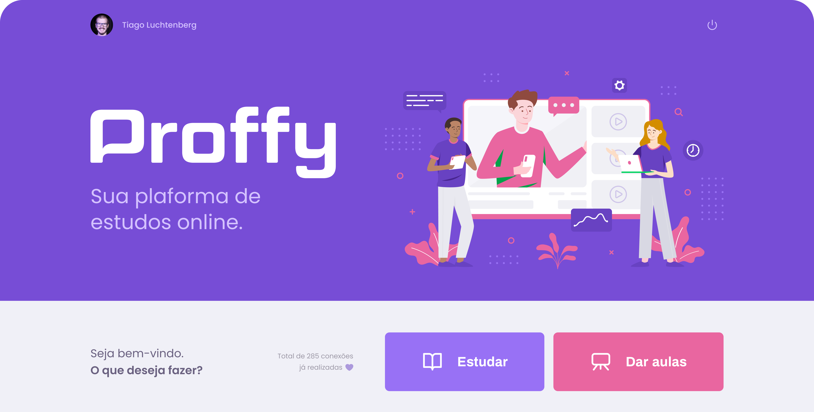

## Introdução

O projeto tem como objetivo a aprendizagem de algumas ferramentas do ecosistema do desenvolvimento frontend por meio da prática.

## Layout do Projeto

- [Figma](https://www.figma.com/file/pMFCskAYP1knLQfRDoB5FA/Proffy?type=design&node-id=160-2761&mode=design&t=lhkdkSqcDkoSydJE-0)

## Ferramentas

- Nextjs
- Authjs
- Typescript
- [Tailwind CSS](https://star-fork-7cd.notion.site/Tailwind-CSS-5f84548bddd44e30bbbb9c509b8687ad?pvs=4) -> documentação feita pela @Ana
- Jest and testing library
- Storybook

### Plataformas

- [Vercel](https://vercel.com/)
- [Vercel Postgres](https://vercel.com/postgres)

### Desenvolvimento

criação de branch:

- chore/<explicação-da-task>
- feature/<explicação-da-task>
- bugfix/<explicação-da-task>
- refactor/<explicação-da-task>
- ...

rodando o projeto:

```
yarn dev

http://localhost:3000
```

